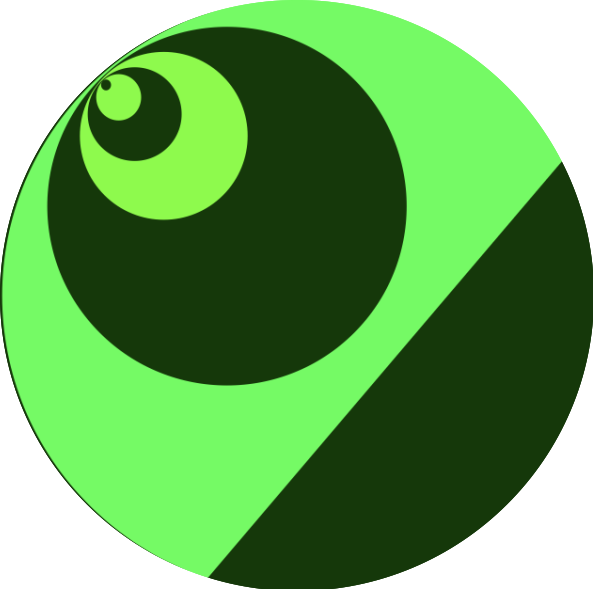

☢️ A fresh-looking, neon theme for Visual Studio Code Almost radioactive.

## ☢️ Previews

## 🚀 Install
1. Go click the extensions tab in Visual Studio Code and search for "radium".
2. Click install, and make sure the extension is from Andrew Nijmeh with out logo.
3. Enjoy!

## Terminals & Vim

- [Vim Theme](https://github.com/radium-theme/vim)
- [Terminals](https://github.com/radium-theme/terminals)